# ITI Graduation Project
## Project Requirements:

#### 1- Install local K8s instance using Minikub (with Ansible).
#### 2- K8s instance will have two Namespaces: tools and dev (installed using Terraform)
#### 3- tools namespace will have pod for Jenkins and nexus(installed using Terraform)
#### 4- dev namespace will run two pods: one for nodejs application and another for MySQL DB
#### 5- Create a Jenkins pipeline job to do the following:
    Checkout code from https://github.com/mahmoud254/jenkins_nodejs_example.git
##### &emsp; a- Build nodejs app usng dockerfile 
##### &emsp; b- Create a Docker image
##### &emsp; c- Upload Docker image to nexus
#### 6- Create another Jenkins pipeline job that run the Docker container on the requested environment from nexus on minikube.
#### 7- Configurations of micro-services should either be handled using secrets in K8s.

## Built With

  
- [Jenkins](https://www.jenkins.io) - Automation Server For CI/CD Pipelines.
- [Terraform](https://www.terraform.io) - Infrastrcuture as code
- [Kubernetes](https://www.kubernetes.io) - Container Orchestration
- [Docker](https://www.docker.com) - Application Containerization
- [Ansible](https://www.ansible.com/) - Configuration Management Tool
- [nexus](https://sonatype.com/) - Repository Management

## Demo Description:
### Run Ansible Script: 
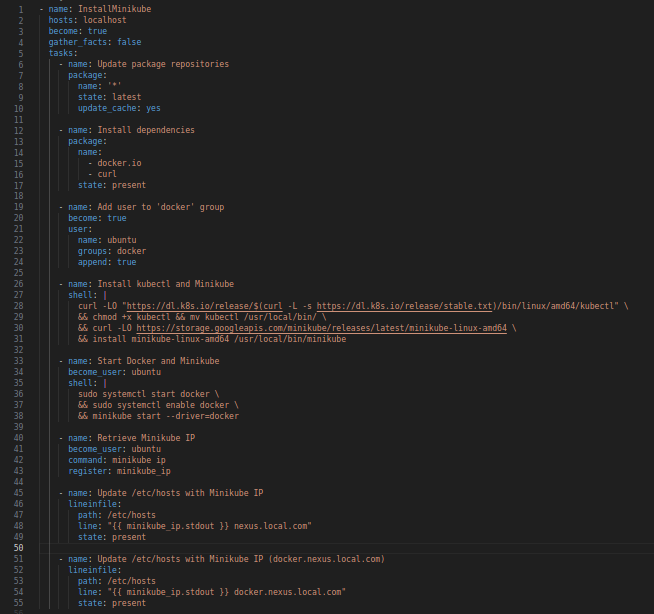
### Output:
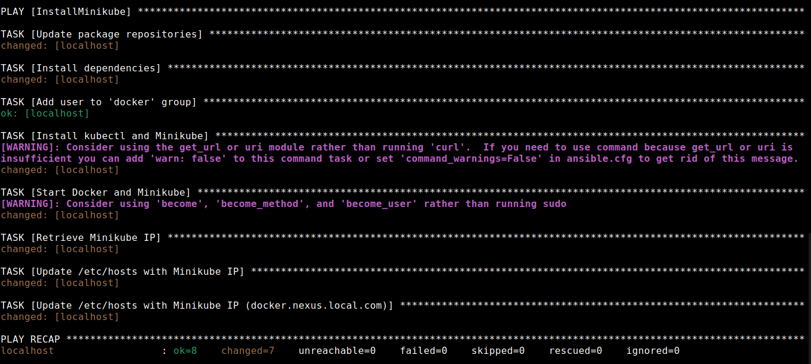

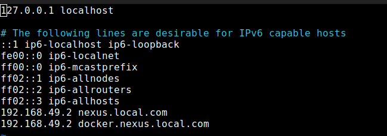

---

### Configure Jenkins: 
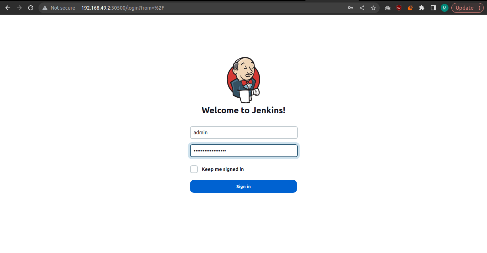

---

### Configure Nexus: 
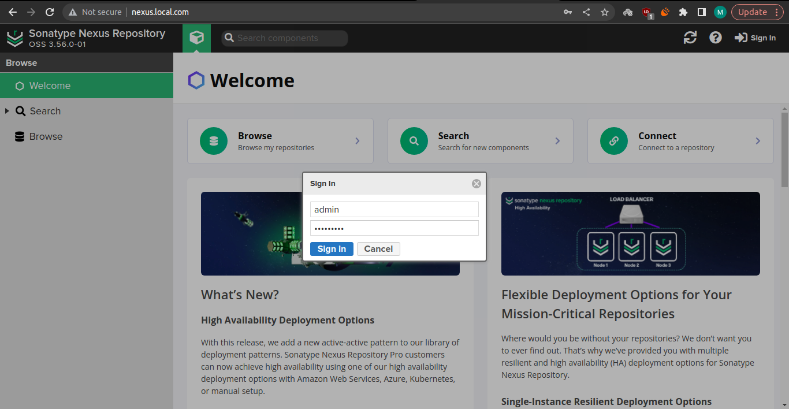

---

### Create Nexus Repo: 
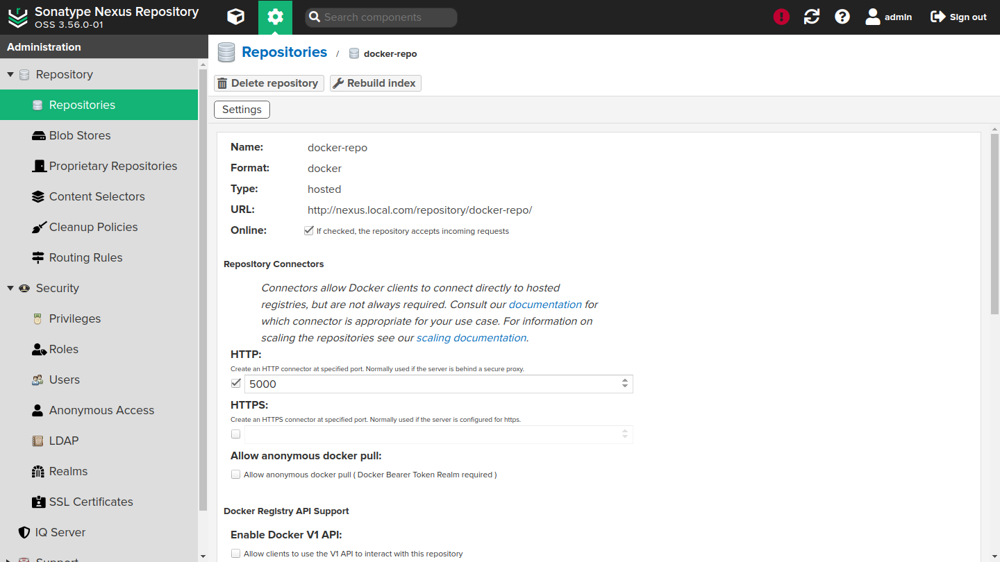

---

### Nexus app images: 
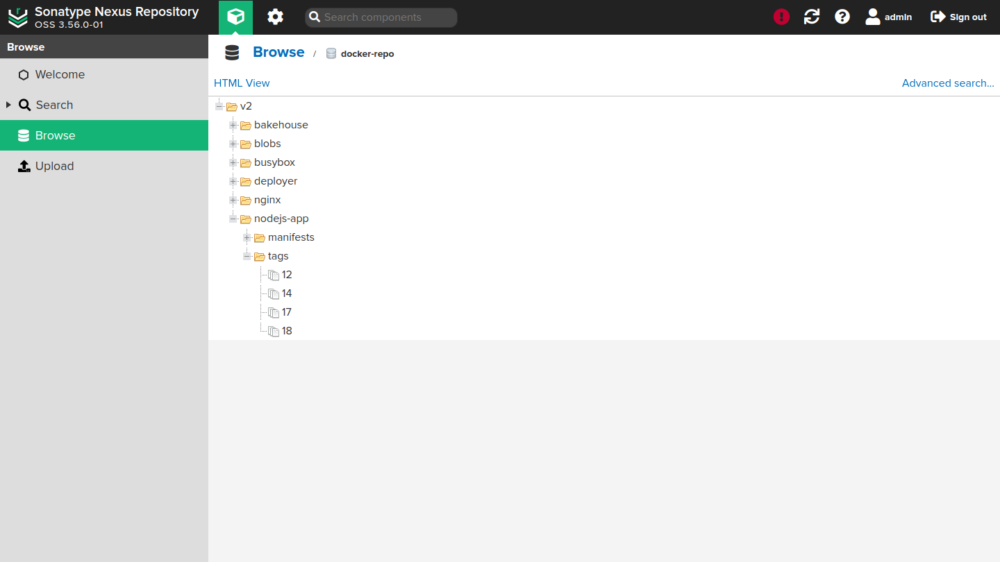

---

### Config Kaniko: 
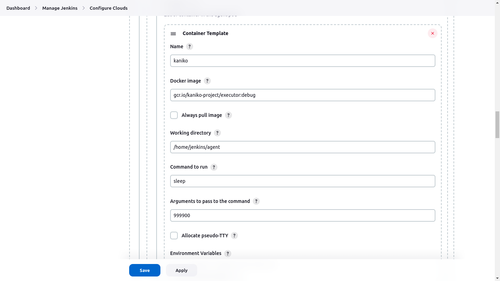

---

### Config Kube-agent: 
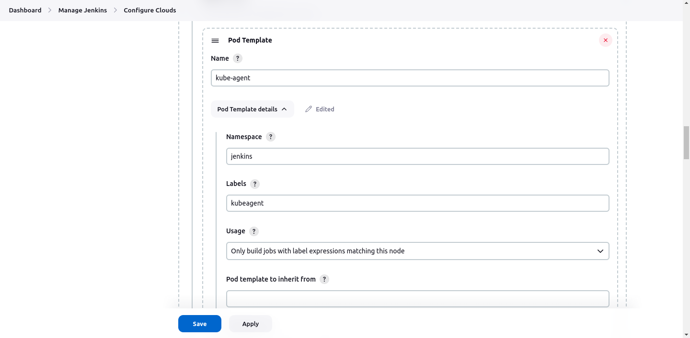

---

### Config App Deployer: 
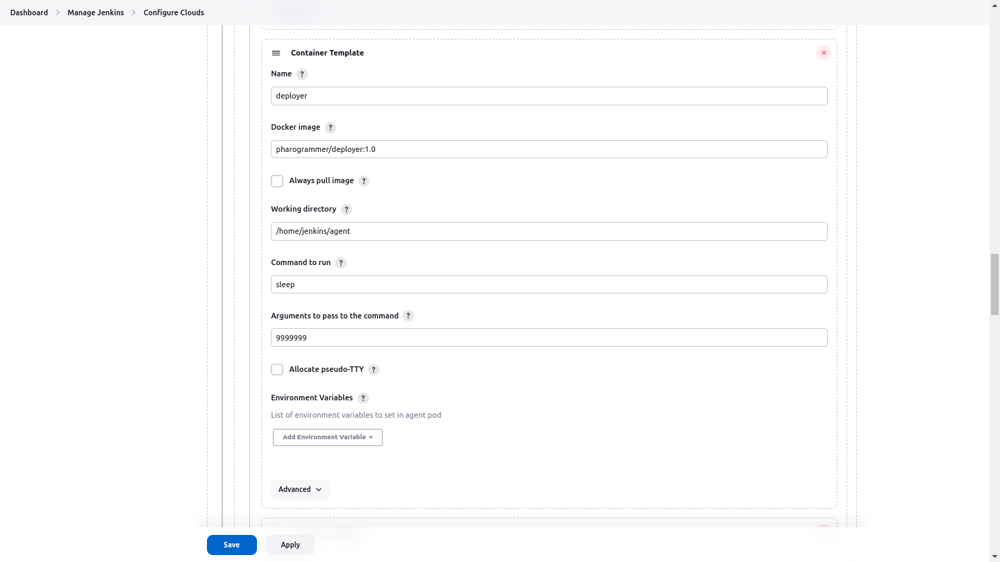

---

### NodeJs App: 
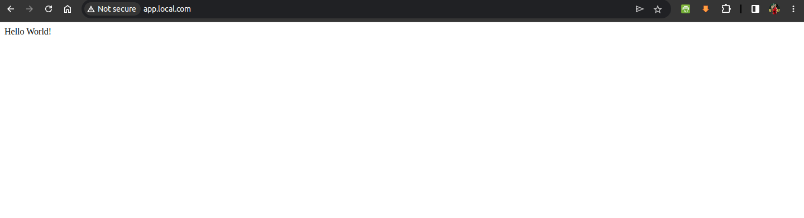

## Deployment Repo for CD Stage [here](https://github.com/moh-amer/graduation_config/)

---

## Contributors:
- [Mohamed Alaa](https://www.linkedin.com/in/mohamed-alaa-amer)
- [Fahd Khaled](https://www.linkedin.com/in/fahd-khaled-dev/)
- [Mahmoud Mansour](https://www.linkedin.com/in/mahmoudmansourr/)
